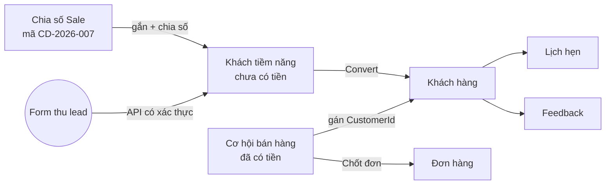
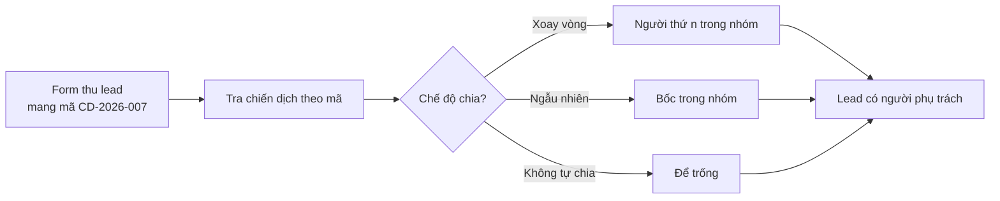
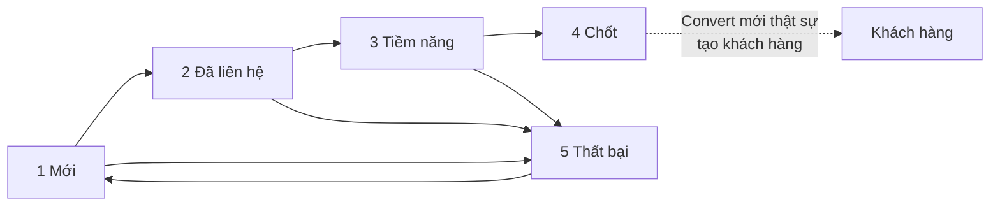

# Luồng nghiệp vụ — CRM

Tài liệu mô tả **hệ thống đang làm gì trên thực tế**, rút từ mã nguồn. Chỗ nào nghiệp vụ mong muốn
có mà mã chưa làm thì ghi thẳng là *CHƯA CÓ*, không mô tả như đã có.

Trỏ mã nguồn dùng **tên lớp + tên phương thức**, cố ý không kèm số dòng: số dòng lệch ngay sau lần
sửa đầu và tài liệu thành nói dối, còn tên phương thức thì tra được bằng tìm kiếm và sống lâu hơn.

## Toàn cảnh — và ba điều hay bị hiểu sai ngay từ đầu

**1. Website vào được, nhưng qua API có xác thực — chưa có cổng công khai.** Không `AllowAnonymous`
nào tạo lead. Form thu lead phải gọi `POST /api/v1/leads` (cần JWT + quyền `lead.create`), gửi kèm
`campaignCode` để được gắn chiến dịch và chia số tự động. Ô "Yêu cầu đến từ website" trên form Cơ
hội vẫn chỉ là một **checkbox nhân viên tự tick** — một lời khai, không phải dấu vết hệ thống ghi.

**2. Khách tiềm năng KHÔNG chuyển thành Cơ hội.** `SalesOpportunity` không có trường nào trỏ về
`Lead`, và `ILeadService` chỉ có `ConvertAsync` ra `Customer`. Đây là **hai phễu song song**, chỉ
gặp nhau gián tiếp ở Khách hàng. Không dòng mã nào đi theo đường đó.

**3. Khác nhau ở chỗ có tiền hay chưa.** Khách tiềm năng là số khách thô (tên + số điện thoại).
Cơ hội là **một nhu cầu cụ thể đã lượng hoá**: đi tuyến nào, mấy người, đơn giá bao nhiêu — không
có số khách và giá thì không tính được giá trị phễu.

---

## Chia số Sale

**Dùng để làm gì.** Gom một tập khách tiềm năng thành chiến dịch rồi phân cho sale, theo dõi tiến
độ chăm sóc và tỷ lệ chốt.

**Sinh ra từ đâu**
- Form trên trang — `LeadCampaignService.CreateAsync`: nhận Tên, Ghi chú, **chế độ chia số** và
  **nhóm sale**; mã `CD-YYYY-NNN` do hệ thống sinh, `Status` ép 0. Sửa được qua `UpdateAsync`.
- API — `LeadCampaignsController.Create`
- Dữ liệu mẫu — `DemoDataSeeder`

**Đi tiếp đâu.** Chiến dịch không sinh bản ghi nào, nhưng nó **quyết định người phụ trách** của
lead đi vào qua mã của nó. Số liệu trên màn đọc ngược từ `Lead.CampaignId`.

**Cách nó chạy**

Chiến dịch có một **mã nhúng** dạng `CD-2026-007` (tự sinh, duy nhất theo công ty). Người dựng form
thu lead chép mã đó vào form. Lead gửi về kèm `campaignCode` thì hệ thống tra ra chiến dịch, gắn
`Lead.CampaignId`, rồi **chia số** cho nhóm nhân viên theo chế độ đã đặt:

| Chế độ | Cách chọn |
|---|---|
| Xoay vòng | Lần lượt theo thứ tự nhóm, hết vòng quay lại. Chia đều tuyệt đối |
| Ngẫu nhiên | Bốc trong nhóm |
| Không tự chia | Để trống người phụ trách |

**Chỗ hay gây khó hiểu**

- **Mã nhúng là thứ đi ra ngoài, không phải khoá.** Form thu lead gửi `campaignCode`, không gửi
  GUID — chép một GUID là cầm chắc sai một ký tự mà không ai phát hiện, lead vẫn vào nhưng rơi vào
  hư không. **Mã không sửa được sau khi tạo**: nó đã nằm trong form đang chạy.

- **Không có ô chọn chiến dịch trên form CRM, và đó là cố ý.** Chiến dịch do người dựng form gán
  sẵn cho cả đợt, không phải thứ nhân viên bán hàng ngồi chọn cho từng số. Một ô phải điền tay cho
  mỗi bản ghi là một ô mãi mãi rỗng.

- **Con đếm vòng chia đếm ở CSDL mỗi lần, KHÔNG cache.** Cache dù vài giây thì mọi lead trong
  khoảng đó đọc cùng một con đếm nên cùng về một người — vòng chia đứng im mà nhìn bên ngoài vẫn
  tưởng đang xoay. Phần *cấu hình* chiến dịch thì có cache (60 giây, xoá ngay khi sửa).

- **Mã sai không chặn lead.** Lead vẫn được tạo, chỉ là không gắn chiến dịch — ném lỗi ở đây nghĩa
  là form thu lead trả lỗi cho khách vì một cái mã gõ nhầm trong nội bộ.

- **Cột "Người tạo" luôn rỗng với chiến dịch tạo qua giao diện** — `CreateAsync` không gán
  `CreatedByUserId`. *CHƯA SỬA.*

- `Status` là số thô, chỉ 0 (đang chạy) và 1 (hoàn thành), không phải enum.

- Trang dùng chung quyền `lead.view` của khách tiềm năng, **không có quyền riêng**.

---

## Khách tiềm năng

**Dùng để làm gì.** Số khách thô được chia cho sale — thường chỉ có tên và số điện thoại. Chốt
được thì chuyển thành khách hàng.

**Sinh ra từ đâu**
- Form trên trang — `LeadService.CreateAsync`
- API — `LeadsController.Create` (quyền `lead.create`)
- **Form thu lead** — `POST /api/v1/leads` kèm `campaignCode`: tự gắn chiến dịch và tự chia người
  phụ trách. Đây là đường mà website đi vào.
- Dữ liệu mẫu — `DemoDataSeeder`, `PerfDataSeeder`
- *CHƯA CÓ* nhập từ tệp.

**Đi tiếp đâu**
- Chuyển thành khách hàng — `LeadService.ConvertAsync`: tạo `Customer`, đặt trạng thái `Won`, ghi
  `ConvertedCustomerId`. Chỉ chuyển được **một lần**, lần hai báo lỗi.
- Tra ngược — `LeadService.FindByConvertedCustomerAsync`, dùng bởi `RecordOrigins` để trang khách
  hàng mở lại được lịch sử và đánh giá AI của khách tiềm năng gốc.
- *CHƯA CÓ* đường sang Cơ hội bán hàng.

**Chỗ hay gây khó hiểu**

- **`LeadStatus` bắt đầu từ 1, không phải 0**: 1 Mới · 2 Đã liên hệ · 3 Tiềm năng · 4 Chốt ·
  5 Thất bại.

- **Luồng trạng thái chỉ được ép ở phía trình duyệt.** Trang khai bước đi hợp lệ
  (1→[2,5], 2→[3,5], 3→[4,5], 5→[1]), nhưng máy chủ chỉ kiểm `Enum.IsDefined`. Gọi thẳng handler
  để nhảy từ 1 sang 4 là được.

- **"Chốt" không đồng nghĩa "đã chuyển thành khách hàng".** Đặt trạng thái Chốt bằng tay **không**
  tạo khách hàng nào. Cột "Đã chuyển KH" đọc `ConvertedCustomerId`, và hai thẻ số ở đầu trang đếm
  hai thứ khác nhau.

- **Chuyển đổi đi QUA `CustomerService`** nên khách sinh ra có đủ mã `KH_`, `SearchName` (tìm không
  dấu) và `PhoneNormalized` — tìm ra được, và lọt vào màn Rà khách trùng như mọi khách khác.
  Số điện thoại đã có chủ thì **NỐI vào hồ sơ sẵn có**, không tạo bản sao, và màn hình nói rõ điều
  đó. *(Bản trước ghi thẳng vào kho nên thiếu cả ba thứ trên — đã sửa.)*

- **Người phụ trách đi theo sang khách hàng.** Hộp xác nhận lúc chuyển đổi có ô chọn, mặc định là
  người đang giữ lead — bàn giao phải do người bấm nút quyết định, không xảy ra âm thầm.

- **Nguồn có HAI TẦNG, đừng lẫn.** `Source` là giá trị CHUẨN lấy từ danh mục /nguon-khach — đó là
  chiều để gộp báo cáo, nên hữu hạn và không cho gõ tự do (gõ tay thì "Facebook", "facebook", "FB"
  thành ba nguồn và báo cáo vỡ theo). Còn `AttributionJson` giữ phần CHI TIẾT tuỳ ý: `utm_source`,
  `utm_medium`, `utm_campaign`, trang đích, referrer, cộng mọi tham số lạ trong `khac`. Dán nguyên
  đường dẫn chiến dịch vào ô "Nguồn chi tiết" là hệ thống tự tách. Thêm một chiều mới chỉ là thêm
  một khoá, không phải migration.

- **`Note` giữ nhu cầu khách tự nêu.** Đây là trường quyết định tư vấn đúng hay sai, và là thứ phần
  chấm điểm AI đọc đầu tiên. Lúc chuyển đổi nó đi theo sang "nhu cầu ban đầu" của khách hàng.

- **Handler ghi không kiểm quyền.** Trang chỉ gác `lead.view`; Lưu / Chuyển đổi / Xoá / Đổi trạng
  thái đều **không** kiểm thêm, trong khi API có tách `lead.create`, `lead.update`, `lead.delete`,
  `lead.convert`.

---

## Cơ hội bán hàng

**Dùng để làm gì.** Phiếu yêu cầu đi tour của khách, chạy qua phễu tới lúc chốt thành đơn. Bám
`BookingTicket` của hệ cũ.

**Sinh ra từ đâu**
- Form trên trang — `SalesOpportunityService.CreateAsync` (`StageCode` luôn khởi tạo là Tạo mới)
- Dữ liệu mẫu — `DemoDataSeeder`
- **Không có API REST** cho cơ hội; chỉ handler Razor. *CHƯA CÓ* cổng website.

**Đi tiếp đâu**
- Chốt đơn — `IBookingService.CreateBookingAsync`, rồi `BookingService.ChotCoHoiAsync` đánh dấu
  `ConvertedOrderId` và đặt bước Chốt đơn **sau khi đơn thật đã lưu**
- Nuôi báo cáo phễu
- Ô số điện thoại tra khách theo số; chưa có thì **tạo nhanh khách hàng** qua
  `TkListPageModel.OnPostTaoNhanhKhachAsync`

**Chỗ hay gây khó hiểu**

- **`TemplateId` là MẪU TOUR KHÁCH ĐANG HỎI** (tên cũ `TourIdRoot`), cho null vì lúc mới tiếp xúc
  chưa biết khách muốn tuyến nào. Đừng lẫn với `TourDepartureId` — đó là **chuyến cụ thể** khi khách
  đã nhắm được ngày. Một cái là "hỏi tuyến gì", một cái là "đi chuyến nào".

- **`StageCode` trỏ theo MÃ, không theo khoá.** Cố ý: đổi tên hay sắp lại cột mà cơ hội cũ vẫn giữ
  đúng bước. Bộ cột **cấu hình được theo từng công ty**; chỉ hai mã bị khoá cứng bằng luật:
  **5 Huỷ** (bắt buộc có lý do) và **6 Chốt đơn** (không đặt tay được).

- **Kéo thẻ sang "Chốt đơn" bị chặn** — phải có đơn thật phía sau. Đây là hàng rào chống doanh thu
  dự kiến ảo.

- **DTO sửa cố ý KHÔNG có `StageCode`**, để thao tác lưu form thường không lách được hai luật trên.

- **`IsConfirmed` / `ConfirmedAt` / `ConfirmedByUserId` KHÔNG BAO GIỜ được ghi.** Chỉ có đọc, chiếu
  ra lưới, và một **bộ lọc**. Không Create/Update/handler nào gán. Nghĩa là trường này luôn false và
  **bộ lọc "đã xác nhận" luôn trả rỗng** — nhìn như một tính năng có sẵn nhưng thực chất chưa làm.

- **Giá trị dự kiến không có cột riêng**, tính bằng `OpportunityMath.GiaTriSelector` = tổng
  (số lượng × đơn giá) của cả bốn bậc khách. Viết dạng biểu thức để vừa cộng được ở SQL vừa tính
  được trong bộ nhớ.

- **Bốn bậc khách** (người lớn, trẻ em, trẻ nhỏ, em bé) trong khi hệ cũ chỉ ba — cố ý khớp với bậc
  khách của đơn để lúc chốt không rơi mất bậc trẻ nhỏ.

- **`CustomerId` nullable trên bản ghi nhưng validator BẮT BUỘC.** Giữ nullable vì lúc mới nhận yêu
  cầu thường chưa có hồ sơ khách; bản ghi đồng thời giữ cả thông tin liên hệ rời lẫn khoá sang khách.

- **Cơ hội đã chốt thì khoá sửa, khoá xoá, khoá chuyển cột.**

- **`Code` nhập tay**, không tự sinh, chống trùng theo công ty.

- Màn này **kiểm quyền chặt nhất trong CRM**: mọi handler ghi đều đòi `opportunity.manage`.

---

## Báo cáo phễu cơ hội

**Dùng để làm gì.** Gộp hai câu hỏi cạnh nhau: bảng trên nói ai chốt được bao nhiêu, bảng dưới nói
vì sao phần còn lại không chốt.

**Sinh ra từ đâu.** Không sinh gì — thuần đọc `ReportByUserAsync` và `ReportCancelReasonsAsync`.

**Đi tiếp đâu.** Không sinh gì; đầu ra chỉ là bảng trên màn hình.

**Chỗ hay gây khó hiểu**

- **Tổng của báo cáo KHÔNG bằng tổng của màn Cơ hội.** Báo cáo gom qua bảng người phụ trách và bỏ
  người theo dõi. Hệ quả:
  - Cơ hội **không gán ai** thì **không xuất hiện** trong báo cáo.
  - Cơ hội gán **hai người** thì **đếm cho cả hai**.

- **Khoảng ngày lọc theo NGÀY TẠO cơ hội**, không phải ngày chốt hay ngày huỷ.

- **Hai mốc thời gian tách đôi có chủ đích.** Mốc để *hiển thị* giữ nguyên giờ máy chủ (quy về UTC
  sẽ làm ô ngày hiện lùi một ngày ở giờ VN); mốc để *truy vấn* mới quy UTC, và ngày "đến" cộng
  thêm một ngày trừ một tích để gồm trọn ngày cuối kỳ. Đây **không** phải chỗ dùng `TkDate.Day`, vì
  `CreatedAt` là mốc thời gian thật chứ không phải ngày nghiệp vụ.

- **Tỉ lệ chốt chung tính lại từ tổng**, không lấy trung bình các dòng: người giữ 100 cơ hội và
  người giữ 2 cơ hội không thể cùng trọng số.

- Nhóm "Không rõ lý do" chỉ chứa dữ liệu có từ trước khi có luật bắt buộc, hoặc lý do đã bị xoá khỏi
  danh mục — vẫn hiện ra để tổng khớp.

---

## Data khách hàng

**Dùng để làm gì.** Hồ sơ khách dùng chung cho mọi module. Là nơi mọi nhánh bán hàng gặp nhau.

**Sinh ra từ đâu**
- Form trên trang — `CustomerService.CreateAsync` / `UpdateAsync`
- **Tạo nhanh từ bất kỳ form nào có ô số điện thoại** — `TkListPageModel.OnPostTaoNhanhKhachAsync`
  (dùng ở Cơ hội, đơn hàng, báo giá, đặt dịch vụ)
- **Chuyển từ khách tiềm năng** — `LeadService.ConvertAsync`, **ghi thẳng kho, không qua
  `CustomerService`** (xem hệ quả ở mục Khách tiềm năng)
- API — `CustomersController`
- *CHƯA CÓ* nhập từ Excel/CSV; chỉ có xuất.

**Đi tiếp đâu.** Khách là điểm neo của đơn hàng, lịch hẹn và cơ hội. Trang chi tiết đọc đơn và lịch
chăm sóc theo khách, và tra ngược về khách tiềm năng gốc qua `RecordOrigins`.

**Chỗ hay gây khó hiểu**

- **`CrmProfileJson` gói mọi trường mềm vào một cột JSON** để thêm trường không cần migration. Khoá
  tham chiếu bên trong lưu **chuỗi** để migrate được id cũ không phải GUID.

- **Hệ quả: danh sách có hai đường chạy.** Lọc thuần cột thật → phân trang ở SQL. Lọc chạm trường
  trong JSON hoặc số liệu tổng hợp → **nạp toàn bộ ứng viên rồi lọc trong bộ nhớ**.

- **`SearchName` và `PhoneNormalized` là cột phái sinh do C# ghi lúc tạo/sửa.** Bản ghi đi đường
  tắt (chuyển từ khách tiềm năng, seeder) để trống hai cột này và **tìm không ra**.

- **Khách định danh bằng SỐ ĐIỆN THOẠI**, chặn trùng đặt ở tầng dịch vụ để API không lách được. Số
  ngắn hơn 8 chữ số thì bỏ qua — họ tên không phải khoá định danh.

- **`CustomerType` là số thô và nhãn bị lệch**: chú thích trong bản ghi ghi 0 Cá nhân · 1 Doanh
  nghiệp · 2 Đối tác · 3 CTV, nhưng danh mục gieo ra lại là "Khách lẻ / Doanh nghiệp / Đại lý /
  Cộng tác viên". Trang hiển thị lấy theo danh mục.

- `Code` tự sinh dạng `KH_` + 8 ký tự ngẫu nhiên — **không tăng dần, không tái dùng**.

- Ô tìm "thông minh": gõ toàn số → khớp số điện thoại chuẩn hoá; có chữ → khớp tên không dấu, mã,
  email.

- **Handler ghi không kiểm quyền** (chỉ gác `customer.view` ở cấp trang), dù API có tách bốn quyền.

---

## Rà khách trùng

**Dùng để làm gì.** Liệt kê các nhóm hồ sơ khách bị trùng.

**Sinh ra từ đâu.** Không sinh gì — thuần đọc `CustomerService.FindDuplicatesAsync`.

**Đi tiếp đâu.** **Không có chức năng gộp.** Trang chỉ có link về danh sách và link mở chi tiết
từng khách. *CHƯA CÓ* thao tác merge.

**Chỗ hay gây khó hiểu**

- **Hai tiêu chí chạy độc lập nên một khách có thể hiện hai lần**: nhóm theo số điện thoại chuẩn
  hoá, và nhóm theo email; hai kết quả nối lại. Cặp trùng cả số lẫn email sẽ xuất hiện ở **cả hai**
  nhóm.

- *(Trước đây khách chuyển từ lead không bao giờ lọt vào đây vì đường chuyển đổi không ghi
  `PhoneNormalized`. Đã chữa ở gốc — xem mục Khách tiềm năng.)*

- Nhóm theo số điện thoại về lý thuyết chỉ còn dữ liệu có từ trước khi luật chặn trùng được đưa
  xuống tầng dịch vụ. Nhóm theo **email thì không có luật chặn nào**, nên vẫn sinh mới bình thường.

- Trang **nạp toàn bộ bảng khách** rồi gom trong bộ nhớ, và **không phân trang**.

---

## Quản lý lịch hẹn

**Dùng để làm gì.** Việc cần làm với khách theo mốc thời gian: gọi lại, gửi báo giá, nhắc thanh
toán — kèm nhắc hẹn và phản hồi.

**Sinh ra từ đâu**
- Form trên trang — `CustomerCareService.CreateAsync` (bắt buộc có khách và khách phải tồn tại)
- API — `CustomerCaresController.Create` (quyền `care.manage`)
- Dữ liệu mẫu — `DemoDataSeeder`, `PerfDataSeeder`
- **Job nền KHÔNG tạo bản ghi**, chỉ cập nhật.

**Đi tiếp đâu**
- `CareReminderJob` quét lịch tới hạn, gửi email cho người phụ trách rồi đánh dấu đã gửi
- Nuôi cột "CSKH gần nhất" và các nhóm lọc "chưa liên hệ" ở màn Khách hàng

**Chỗ hay gây khó hiểu**

- **Bảng kanban có HAI KIỂU CỘT trên cùng một màn.** Cột theo **trạng thái** (Mới / Đang xử lý /
  Hoàn thành) và cột theo **thời gian** (Quá hạn / Hôm nay / Ngày mai / Trong tuần / Sau đó / Chưa
  hẹn). **Kéo thẻ giữa các cột thời gian là DỜI NGÀY HẸN, không phải đổi trạng thái.** Thả vào
  "Quá hạn" bị từ chối.

- **Thang quy đổi lúc thả khác thang lúc lọc**: thả vào "Trong tuần" đặt thành +7 ngày (không phải
  một ngày nào đó trong 2–7), "Sau đó" đặt +30.

- **"Quá hạn" đã loại việc Hoàn thành** — việc đã xong thì không còn là nợ.

- **`RemindAt` bị ghi theo HAI quy ước khác nhau**: đường dời lịch ép về ngày nghiệp vụ neo offset 0,
  còn đường lưu form lại quy UTC. Cùng một cột, hai lối ghi — đây là chỗ nên thống nhất.

- **`Feedback` chỉ ghi được khi SỬA**, không nhận lúc tạo — phản hồi là thứ điền sau.

- `ReminderSentAt` là **cờ chống gửi trùng của job**, không phải dữ liệu nghiệp vụ. Người nhận
  không hợp lệ thì **cố tình không đánh dấu** để lần chạy sau gửi lại.

- Từ khoá **chỉ khớp Tiêu đề**, không khớp nội dung, phản hồi hay tên khách.

- **Handler ghi không kiểm `care.manage`**, trong khi API có.

---

## Feedback chung

**Dùng để làm gì.** Đánh giá sau tour: số sao + nhận xét, danh sách phẳng từng lượt.

**Sinh ra từ đâu**
- Form trên trang — `TourRatingService.CreateAsync`
- API — `TourRatingsController.Create` (quyền `rating.manage`). Đây là **đường duy nhất truyền được
  chuyến và đơn**.
- Dữ liệu mẫu — `DemoDataSeeder` (gắn đúng đơn đã xác nhận)
- *CHƯA CÓ* cổng để khách tự đánh giá.

**Đi tiếp đâu.** Không sinh bản ghi khác; cấp dữ liệu cho trang Feedback theo Tour.

**Chỗ hay gây khó hiểu**

- **Đánh giá nhập tay ở trang này KHÔNG gắn chuyến và KHÔNG gắn đơn.** Handler truyền thẳng
  `CreateTourRatingDto(null, null, …)` và form không có ô chọn chuyến. Hệ quả:
  **mọi đánh giá nhập ở đây sẽ KHÔNG BAO GIỜ xuất hiện ở trang Feedback theo Tour**, vì trang đó
  chỉ lấy đánh giá có gắn chuyến. Và **sửa cũng không gắn lại được** — đã tạo rời thì rời mãi.

- **`Status` ở đây là kiểm duyệt, không phải trạng thái nghiệp vụ**: 0 Ẩn · 1 Hiển thị.

- **Tên nhân viên trên lưới có thể không phải giá trị đang lưu.** Cột sale và điều hành hiển thị
  theo lối dự phòng: không có trên đánh giá thì lấy từ đơn / từ chuyến.

- **Đánh giá KHÔNG nối được vào hồ sơ khách** — chỉ có tên và số điện thoại dạng chuỗi rời, không
  có khoá sang khách hàng.

---

## Feedback theo Tour

**Dùng để làm gì.** Tổng hợp đánh giá **gom theo chuyến**: số lượt và sao trung bình.

**Sinh ra từ đâu.** Không sinh gì — thuần đọc `TourRatingService.ListByTourAsync`.

**Đi tiếp đâu.** Không sinh gì. Không form, không handler ghi.

**Chỗ hay gây khó hiểu**

- **Chỉ đếm đánh giá CÓ gắn chuyến.** Cộng với việc trang Feedback chung tạo đánh giá không gắn
  chuyến, **hai màn có thể lệch số rất xa mà không có gì trên giao diện giải thích**. Đây là cặp
  vấn đề nên đọc cùng nhau.

- **Phân trang chạy trong bộ nhớ**: gom nhóm ở SQL rồi cộng dồn và cắt trang trong C#.

- **Không có bộ lọc, không ô tìm, không xuất file, không thẻ số** — khác hẳn trang Feedback chung.

- Thứ tự cố định theo số lượt giảm dần; phần đứng sau sắp theo khoá chuyến nên **thứ tự phụ là tuỳ
  ý**, không theo ngày hay tên.

---

## Ghi chú chung về quyền

Có một **lệch pha nhất quán** giữa Razor và API: các màn Khách tiềm năng, Chia số Sale, Khách hàng,
Lịch hẹn, Feedback chỉ gác `*.view` ở cấp trang, còn **mọi handler ghi không kiểm quyền
manage/create/update/delete**, dù danh mục quyền có tách đủ. Riêng màn **Cơ hội bán hàng** kiểm đủ
qua `opportunity.manage`.

Nghĩa là: ai mở được màn thì sửa được dữ liệu trên màn đó, trừ Cơ hội.
