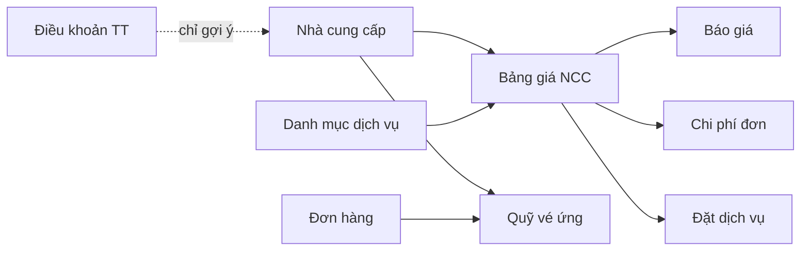
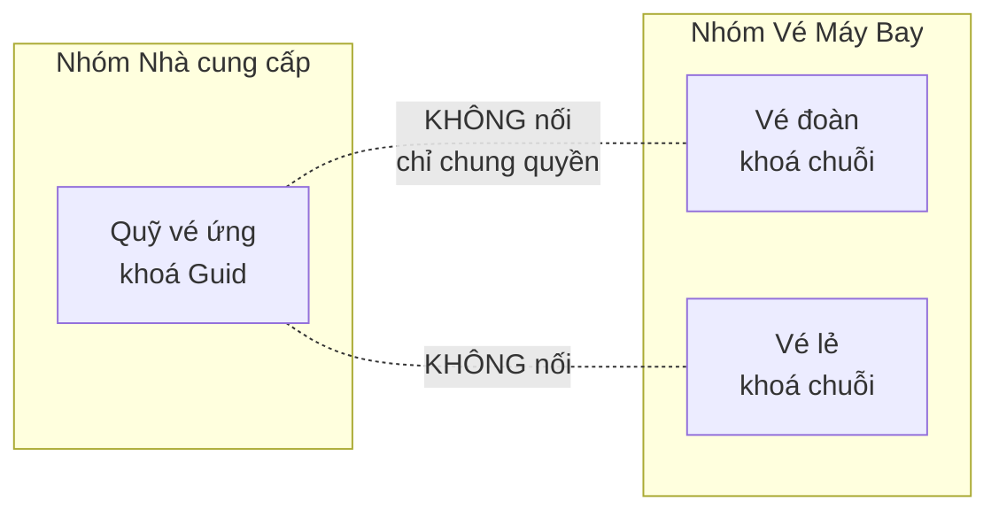

# Luồng nghiệp vụ — Nhà cung cấp

Tài liệu mô tả **hệ thống đang làm gì trên thực tế**, rút từ mã nguồn. Chỗ nào nghiệp vụ mong muốn
có mà mã chưa làm thì ghi thẳng là *CHƯA CÓ*, không mô tả như đã có.

Trỏ mã nguồn dùng **tên lớp + tên phương thức**, cố ý không kèm số dòng: số dòng lệch ngay sau lần
sửa đầu và tài liệu thành nói dối, còn tên phương thức thì tra được bằng tìm kiếm và sống lâu hơn.

## Toàn cảnh

Đọc hình trên theo một câu: **nhà cung cấp là gốc của mọi giá vốn**. Dịch vụ nói "mua cái gì",
bảng giá nói "bao nhiêu tiền", rồi ba nơi tiêu thụ nó là báo giá, chi phí đơn và đặt dịch vụ.

---

## Nhà cung cấp

**Dùng để làm gì.** Đối tác bán dịch vụ đầu vào: khách sạn, nhà xe, nhà hàng, hướng dẫn viên, hãng
bay, voucher. Là gốc của mọi giá vốn trong hệ thống.

**Sinh ra từ đâu**
- Form tạo/sửa trên trang — `ProviderService.CreateWithServicesAsync` / `UpdateWithServicesAsync`
  (`src/TourKit.Application/Providers/ProviderService.cs`). Ghi nhà cung cấp **kèm bảng giá** trong
  cùng một đường.
- "Thêm bằng AI" — `IndexModel.OnPostAiPhanTichNccAsync`: đọc PDF/Word rồi **điền sẵn form**,
  không ghi thẳng xuống CSDL.
- API — `ProvidersController.Create` / `Update` (đường này **không** kèm bảng giá).
- Dữ liệu mẫu khi phát triển — `DemoDataSeeder.ProvOf`.
- *CHƯA CÓ* đường nhập danh sách nhà cung cấp từ tệp (nhập từ tệp chỉ có cho bảng giá).

**Đi tiếp đâu**
- Chi phí đơn hàng — `OrderCostService.CreateAsync`
- Phiếu chi — `PaymentVoucher.ProviderId`
- Đặt dịch vụ lẻ — `QuoteConversionService` sinh `ServiceBooking` khi chuyển báo giá thành đơn
- Điều hướng dẫn viên — `TourGuideAssignment.ProviderId` (hướng dẫn viên chính là nhà cung cấp loại Guide)
- Quỹ vé — `TicketFund.ProviderId`
- Công nợ — `IReportService.GetProviderDebtAsync`, màn `/cong-no-ncc`

**Chỗ hay gây khó hiểu**

- **Voucher mang số 7, không phải 2.** `ProviderType`: 1 Khách sạn · 2 Vận chuyển · 3 Nhà hàng ·
  4 HDV · 5 Hãng bay · 6 Khác · **7 Voucher**. Hệ cũ đánh Voucher là 2, nhưng ở đây 2 đã là Vận
  chuyển và đang có dữ liệu — đánh lại số là đổi nghĩa mọi dòng đã lưu.

- **`ProfileJson` — trường mềm gom vào một cột JSON.** Mỗi loại nhà cung cấp có vài trường riêng
  (khách sạn có "Năm xây dựng", vận chuyển có "Xe nhà / Xe đối tác" và danh sách loại xe). Đổ ra
  cột thật thì bảng đầy cột null và thêm trường cho một loại lại phải chạy migration.
  **Luật:** thứ cần LỌC hay SẮP XẾP ở SQL phải là cột thật (Tỉnh/Thành, Thị trường, Đánh giá) —
  lọc trong JSON là quét cả bảng.

- **Đổi loại nhà cung cấp thì trường riêng của loại cũ MẤT.** `HoSoTuInput` chỉ giữ trường của đúng
  loại đang chọn. Đây là cố ý, để không tồn lại dữ liệu vô hình mà giao diện không hiện ra nữa.

- **Lưu bảng giá kèm form thì dòng không gửi lên sẽ bị XOÁ MỀM.** `UpdateWithServicesAsync` coi
  danh sách gửi lên là toàn bộ sự thật. Ngược lại `ThemDichVuAsync` chỉ **nối thêm** — đó là đường
  dùng cho nhập từ tệp. Dùng nhầm đường là mất sạch bảng giá.

- **`Rate` là điểm đánh giá, không phải tỉ giá.**

---

## Danh mục dịch vụ

**Dùng để làm gì.** Danh mục các loại dịch vụ có thể mua của nhà cung cấp: phòng, xe, vé, visa,
tham quan. Là thứ được chọn ở từng dòng bảng giá.

**Sinh ra từ đâu**
- Form trên trang — `ServiceItemService.CreateAsync` / `UpdateAsync`
- API — `ServiceItemsController`
- Dữ liệu mẫu — `DemoDataSeeder.SvcOf`
- *CHƯA CÓ* đường nhập từ tệp.

**Đi tiếp đâu.** Chỉ **một** nơi tiêu thụ: `ProviderService.ServiceItemId` (bảng giá). Không entity
nào khác giữ khoá này.

**Chỗ hay gây khó hiểu**

- **`Category` ở đây LỆCH số với `ProviderType`.** Danh mục dịch vụ: 6 = Visa, 7 = Khác. Nhà cung
  cấp: 6 = Khác, 7 = Voucher. Hai bộ số **không dùng chung được**, và danh mục dịch vụ **không có**
  mã Voucher. Đọc lướt rất dễ tưởng chúng khớp nhau.

- **`Category` chỉ là nhãn hiển thị, không ràng buộc gì.** Không chỗ nào lọc dịch vụ theo loại khi
  chọn cho một nhà cung cấp — gán "Thuê phòng" cho một hãng bay là hợp lệ về mặt mã.

- **Tìm theo từ khoá thì nạp cả bảng rồi lọc trong bộ nhớ** (`ServiceItemService.ListAsync`), vì EF
  không dịch được `StringComparison`. Chấp nhận được do đây là danh mục nhỏ.

---

## Bảng giá NCC

**Dùng để làm gì.** Giá của **một dịch vụ, của một nhà cung cấp**. Quyết định giá vốn của tour.

**Sinh ra từ đâu**
- Form trên chính trang này — `ProviderServiceService.CreateAsync` / `UpdateAsync`
- **Từ form nhà cung cấp** (panel Sản phẩm/Dịch vụ) — `ProviderService.CreateWithServicesAsync`
- **Nhập từ tệp**, hai đường cùng đổ về `ProviderService.ThemDichVuAsync`:
  Excel/CSV đi lối tất định `DocBangTuTep.Doc` + `NhapDichVuService.XemTruoc`;
  PDF/Word đi lối `AiBangGia.DocAsync`. Có bước **xem trước, chưa ghi** rồi mới ghi thật.
- API — `ProviderServicesController`

**Đi tiếp đâu**
- Báo giá — `QuoteLine.ProviderServiceId`, kiểm tồn tại ở `QuoteService.ValidatePriceRefsAsync`
- Chuyển báo giá thành đơn — `QuoteConversionService` dò ngược ra nhà cung cấp để sinh đặt dịch vụ
- Chi phí đơn — `OrderCostService.CreateAsync`, có kiểm **dòng giá phải thuộc đúng nhà cung cấp**
- Quỹ vé — `TicketFund.ProviderServiceId`

**Chỗ hay gây khó hiểu**

- **`ContractPrice` là giá vốn, `PublicPrice` là giá công bố.** Cả hai theo `CurrencyCode`; phần
  quy đổi sang VND lấy `Currency.RateToVnd`, và **VND / null / mã không tìm thấy đều tính hệ số 1**.

- **BẪY LỚN: trang này KHÔNG sửa được trường riêng theo loại.** `ProfileJson` ở mức DÒNG giữ
  "Giai đoạn từ/đến", "Loại ngày", "Hành trình vé", "Hạn cắt cọc"… nhưng DTO tạo/sửa của trang
  `/bang-gia-ncc` **không có** trường `Profile`, nên dòng tạo ở đây luôn để trống phần đó (dòng cũ
  thì giữ nguyên, không mất nhưng cũng không sửa được). **Muốn nhập những trường ấy phải vào form
  nhà cung cấp ở `/nha-cung-cap`.**

- **Hai tầng `ProfileJson` khác nhau, đừng lẫn.** Một ở mức NHÀ CUNG CẤP (năm xây dựng, quốc gia),
  một ở mức DÒNG GIÁ (giai đoạn, hành trình vé). Vị trí này bám đúng chỗ nhãn nằm trong hệ cũ.

- **Loại cột riêng lấy theo loại NHÀ CUNG CẤP, không theo dòng.** Khi nhập từ tệp thì đọc
  `ncc.Type` vì tệp không mang loại; khi sửa qua form thì lấy loại **mới đang lưu**, không phải
  loại cũ.

- **`AmountOfPeople` là số khách của gói giá**, không phải số lượng đặt.

---

## Điều khoản TT NCC

**Dùng để làm gì.** Danh mục mô tả lịch trả tiền cho nhà cung cấp, ví dụ "Cọc 30%, còn lại trước
khởi hành 7 ngày".

**Sinh ra từ đâu**
- Form trên trang — `PaymentTermService.CreateAsync` / `UpdateAsync`
- API — `PaymentTermsController` (dùng quyền `provider.create`, không có quyền riêng)
- Dữ liệu mẫu — `DemoDataSeeder.PtOf`

**Đi tiếp đâu**
- Ô chọn ở form nhà cung cấp → `Provider.PaymentTermId`
- Đồng thời làm danh sách gợi ý cho một ô TEXT tự do
- **Ngoài hiển thị thì KHÔNG có gì tiêu thụ nó.** *CHƯA CÓ* chỗ nào đọc `PaymentTermId` để tính
  hạn thanh toán hay sinh lịch chi.

**Chỗ hay gây khó hiểu**

- **Một nhà cung cấp có thể mang HAI điều khoản khác nhau cùng lúc.** Có hai đường lưu song song:
  `Provider.PaymentTermId` (khoá sang danh mục) và `ProviderProfile.PaymentTerm` (**chuỗi TEXT tự
  do**, gõ tay được). Không chỗ nào đồng bộ hai giá trị đó. Danh mục ở đây chỉ đóng vai **gợi ý**,
  không ràng buộc.

- **Trùng tên nhưng KHÁC hẳn `ServicePaymentTerm`.** `PaymentTerm` là **danh mục**.
  `ServicePaymentTerm` là **lịch chi theo đợt** gắn vào một lần đặt dịch vụ (số tiền, hạn, đã chi
  chưa). Hai cái không liên quan nhau trong mã, dù cùng ghi "legacy ServicePaymentTerm" trong chú
  thích. Trang này **chỉ** quản cái thứ nhất.

- **`Status` luôn bằng 0 khi tạo từ giao diện hay API** — DTO không có trường đó và service không
  gán. Chỉ dữ liệu mẫu đặt 1. Trang cũng không hiện cột trạng thái.

- Unique theo **Tên**, không phải theo Mã.

---

## Series Vé / Quỹ vé

**Dùng để làm gì.** Theo dõi vé nhà cung cấp cấp ứng **cho một đơn hàng**: mã vé và việc đóng quỹ.

**Sinh ra từ đâu**
- Chỉ **nhập tay** trên trang — `TicketFundService.CreateAsync` / `UpdateAsync` (cần quyền
  `ticketfund.manage`)
- API — `TicketFundsController`
- Dữ liệu mẫu — `DemoDataSeeder`
- *CHƯA CÓ* đường sinh tự động từ đơn hàng, từ chi phí, từ vé máy bay đoàn, hay từ nhập tệp.

**Đi tiếp đâu**
- Hồ sơ nhà cung cấp `/nha-cung-cap/{id}`, tab Quỹ vé
- Xuất CSV trên chính trang
- **Không nơi nào khác đọc tới.** Đây là bản ghi đầu cuối: không vào báo cáo, không tính công nợ,
  không trừ vào hạn mức vé đoàn.

**Chỗ hay gây khó hiểu**

- **`Status` và `IsClosed` là HAI TRỤC KHÁC NHAU.** `Status`: 0 = chưa sử dụng, 1 = đã sử dụng.
  `IsClosed` là "đã đóng quỹ hay chưa". Một vé **đã dùng vẫn có thể chưa đóng quỹ** và ngược lại;
  đổi trạng thái **không** đụng tới `IsClosed`.

- **Ba thẻ số đầu trang đếm theo `IsClosed`, còn cột trên lưới hiện `Status`.** Hai con số nói hai
  chuyện khác nhau trên cùng một màn — rất dễ nhìn nhầm là một.

- **Dữ liệu cũ có thể mang giá trị ngoài {0,1}** nên phần hiển thị trả "Khác (n)" thay vì vỡ; còn
  đường ghi thì chặn mọi giá trị ngoài 0/1.

- **Đổi đơn của một quỹ vé là không làm được** — `OrderId` bắt buộc lúc tạo nhưng DTO sửa không có
  trường đó.

- **`/quy-ve` KHÔNG nối với `/ve-may-bay-doan` và `/ve-may-bay-le`.** Đây là chỗ hiểu nhầm dễ xảy
  ra nhất của cả module. Ba màn hoàn toàn độc lập trong mã:
  - Quỹ vé tham chiếu bằng `Guid`; hai màn vé máy bay tham chiếu bằng **chuỗi**
    (`ProviderRef`, `OrderRef`) để migrate được id cũ không phải GUID.
  - Không entity nào trỏ sang nhau: vé đoàn không có `TicketFundId`, quỹ vé không có `Pnr`.
  - Không service nào đọc chéo. "Gán tour" ở vé đoàn chỉ ghi `OrderRef`, **không** tạo quỹ vé nào.
  - Chúng chỉ chung nhau **quyền** (`ticketfund.view` / `ticketfund.manage`) và một dòng breadcrumb
    — đó là lý do ba màn trông như một cụm, dù dữ liệu thì không dính nhau.
  - Menu cũng tách: `/quy-ve` nằm trong nhóm **Nhà cung cấp**, hai màn vé nằm trong nhóm
    **Vé Máy Bay**.

