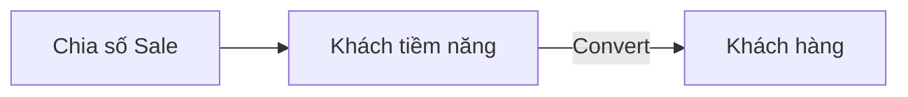

# Tài liệu luồng nghiệp vụ + nút trợ giúp "?" — CRM & Nhà cung cấp

Ngày: 2026-09-23 · Trạng thái: đã duyệt thiết kế, chờ soát spec

## 1. Vấn đề

Nhìn vào một trang danh sách đang chạy, không ai đọc ra được **dữ liệu ở đó sinh từ đâu và đi
tiếp đâu**. Câu hỏi thật của chủ dự án: khách tiềm năng đến từ đâu, cơ hội đến từ đâu, vì sao cơ
hội lại gán `TemplateId` tour.

Những câu đó **có câu trả lời trong mã**, chỉ là không ai đào ra được khi đang đứng trên giao diện.
Ví dụ đã kiểm chứng lúc khảo sát:

```csharp
// src/TourKit.Shared/Entities/SalesOpportunity.cs
/// <summary>Mẫu tour khách đang hỏi (legacy TourIdRoot) — có thể chưa biết.</summary>
public Guid? TemplateId { get; set; }
```

`TemplateId` = mẫu tour khách đang hỏi, cho null vì lúc mới tiếp xúc chưa biết khách muốn tour nào.
Tài liệu này có nhiệm vụ đưa loại hiểu biết đó ra chỗ người dùng đang đứng.

**Không phải** mục tiêu: viết lại đặc tả nghiệp vụ mong muốn. Tài liệu mô tả **hệ thống đang làm
gì trên thực tế**. Chỗ nào code chưa làm mà nghiệp vụ gốc có, ghi thẳng là *CHƯA CÓ trong bản này*
thay vì mô tả như đã có — người đọc cần sự thật, không cần lời hứa.

## 2. Phạm vi

14 trang danh sách, chia hai đợt.

**Đợt 1 — CRM (9 trang)**

| Trang | Route | Quyền |
|---|---|---|
| Chia số Sale | `/chia-so-sale` | `lead.view` |
| Khách tiềm năng | `/khach-tiem-nang` | `lead.view` |
| Cơ hội bán hàng | `/co-hoi` | `opportunity.view` |
| Báo cáo phễu cơ hội | `/bao-cao-co-hoi` | `opportunity.view` |
| Data khách hàng | `/khach-hang` | `customer.view` |
| Rà khách trùng | `/khach-hang/trung-lap` | `customer.view` |
| Quản lý lịch hẹn | `/lich-hen` | `care.view` |
| Feedback chung | `/danh-gia` | `rating.view` |
| Feedback theo Tour | `/danh-gia/theo-tour` | `rating.view` |

**Đợt 2 — Nhà cung cấp (5 trang)**

| Trang | Route | Quyền |
|---|---|---|
| Tất cả Nhà cung cấp | `/nha-cung-cap` | `provider.view` |
| Danh mục dịch vụ | `/danh-muc-dich-vu` | `service.view` |
| Bảng giá NCC | `/bang-gia-ncc` | `service.view` |
| Điều khoản TT NCC | `/dieu-khoan-thanh-toan` | `provider.view` |
| Series Vé / Quỹ vé | `/quy-ve` | `ticketfund.view` |

Loại khỏi phạm vi: *Feedback ZNS* (`/ComingSoon?f=fb-zns`) — chưa là trang thật.

## 3. Kiến trúc — ba mảnh rời

```
docs/business/luong-crm.md            ← nội dung (người viết sửa ở đây)
docs/business/luong-nha-cung-cap.md
          ▲
          │ Doc + Anchor
Pages/Shared/_FlowDocs.cs             ← sổ đăng ký: key → tóm tắt + đích đến
          ▲
          │ model: "lead"
Pages/Shared/_FlowHelp.cshtml         ← partial "?" đặt cạnh tiêu đề trang
```

Mỗi mảnh một việc: markdown giữ **nội dung**, sổ đăng ký giữ **ánh xạ**, partial giữ **cách hiện**.
Sửa lời giới thiệu không phải đụng trang nào; thêm trang mới chỉ thêm một dòng vào sổ.

## 4. Khuôn nội dung mỗi mục

Anchor ASCII tường minh đặt **trên** tiêu đề. Lý do: anchor tự sinh của GitHub cho tiêu đề tiếng
Việt giữ nguyên dấu (`#khách-tiềm-năng`), dễ hỏng khi encode URL và không gõ lại được.

````markdown
<a id="khach-tiem-nang"></a>
## Khách tiềm năng

**Dùng để làm gì.** Một đến hai câu. Đây chính là câu chữ hiện trong tooltip — chép sang sổ đăng ký.

**Sinh ra từ đâu**
- Thêm tay trên trang · Chia số Sale đẩy sang · nhập từ file
  └ `LeadService.CreateAsync` — src/TourKit.Application/Crm/LeadService.cs

**Đi tiếp đâu**
- Chuyển thành Khách hàng (một chiều, có đánh dấu `ConvertedCustomerId`)
  └ `IndexModel.OnPostConvertAsync` — src/TourKit.Api/Pages/Leads/Index.cshtml.cs

**Chỗ hay gây khó hiểu**
- Vì sao trạng thái chỉ có 5 mức mà lưới lại hiện khác…


````

**Trỏ mã nguồn: tên phương thức + đường dẫn file, KHÔNG kèm số dòng.** Số dòng lệch ngay sau lần
sửa đầu, và một tài liệu chỉ sai chỗ là tài liệu mất tín nhiệm toàn bộ. Tên phương thức tra được
bằng tìm kiếm và sống lâu hơn nhiều.

## 5. Sổ đăng ký — `src/TourKit.Api/Pages/Shared/_FlowDocs.cs`

Bám đúng khuôn `_MenuData.cs` đang có (danh sách tĩnh, record ngắn):

```csharp
public sealed record FlowDoc(
    string Key,        // "lead" — khoá partial nhận vào
    string Title,      // "Khách tiềm năng" — đầu đề popover
    string Summary,    // 1–2 câu, hiện trong popover
    string Doc,        // "luong-crm" → docs/business/luong-crm.md
    string Anchor);    // "khach-tiem-nang"
```

URL ghép tại thời điểm render:

```
{FlowDocs:BaseUrl}/blob/{FlowDocs:Branch}/docs/business/{Doc}.md#{Anchor}
```

`BaseUrl` và `Branch` nằm trong `appsettings.json`, **không hardcode trong mã** — hôm nay là nhánh
`dev`, mai gộp `main` thì đổi cấu hình chứ không đi sửa 14 trang.

```json
"FlowDocs": {
  "BaseUrl": "https://github.com/trieuthang1991/tourkit-crm",
  "Branch": "dev"
}
```

Thiếu cấu hình thì partial **không hiện nút** (vẫn hiện tóm tắt) — không dựng link gãy.

## 6. Thành phần "?" — `Pages/Shared/_FlowHelp.cshtml`

Gọi một dòng, đặt cạnh `<h4>` tiêu đề:

```html
<h4>Khách tiềm năng <partial name="_FlowHelp" model="lead" /></h4>
```

**Dùng popover, không dùng tooltip.** Tooltip Bootstrap không chứa được phần tử bấm được; yêu cầu
là trong đó phải có nút đi tới tài liệu.

Quy định hành vi:

- Phần tử kích hoạt là `<button type="button">` chứ không phải `<span>` — bàn phím tab tới được,
  trình đọc màn hình đọc được. Kèm `aria-label="Giới thiệu tính năng"`.
- `trigger: 'hover focus'`, `html: true`, `container: 'body'`.
- Nút bên trong là `<a class="btn btn-sm btn-primary" target="_blank" rel="noopener">`. Dùng thẻ
  `<a>` để **đi lọt bộ lọc HTML mặc định của Bootstrap** — không phải tắt `sanitize`, vì tắt là mở
  một lỗ XSS cho thứ chẳng cần đến nó.
- `delay: { show: 100, hide: 250 }`, và huỷ hẹn-đóng khi chuột vào trong `.popover`. Không có phần
  này thì popover đóng mất trên đường chuột đi từ icon sang nút — lỗi kinh điển của popover hover.
- Mỗi lúc chỉ mở một popover: mở cái mới thì đóng cái cũ.

Khởi tạo gom một chỗ trong `tk.js` (`tk.flowHelp()`), không rải script vào từng trang.

## 7. Chống lạc hậu

Một test trong `tests/TourKit.UnitTests` soát **liên kết giữa sổ đăng ký và markdown**:

1. Mọi `FlowDoc.Doc` phải có file `docs/business/{Doc}.md` tồn tại.
2. Mọi `FlowDoc.Anchor` phải xuất hiện trong file đó dưới dạng `<a id="{Anchor}"></a>`.
3. `Key` không trùng nhau.

Đổi tên mục trong markdown mà quên sửa sổ → test đỏ, thay vì người dùng bấm vào một link chết.

Test **không** kiểm nội dung văn xuôi và **không** kiểm popover trên trình duyệt — không đáng công
và sẽ vỡ vì những thay đổi vô hại.

## 8. Thứ tự thực thi

1. Bộ khung: `_FlowDocs.cs` + `_FlowHelp.cshtml` + `tk.flowHelp()` + cấu hình + test liên kết.
   Nghiệm thu trên **một** trang (Khách tiềm năng) trước khi nhân ra.
2. `luong-crm.md` — soạn 9 mục, đọc mã để lấy sự thật, gắn partial vào 9 trang.
3. `luong-nha-cung-cap.md` — 5 mục, gắn vào 5 trang.

Đợt 2 chỉ bắt đầu khi đợt 1 đã chạy được — nếu khuôn sai thì sai trên 9 trang còn hơn 14.

## 9. Ngoài phạm vi (cắt theo YAGNI)

- Không render markdown trong app; không thêm thư viện markdown.
- Không tự sinh sơ đồ từ mã. Sơ đồ viết tay, vì thứ cần giải thích là **ý định**, mà ý định thì
  máy không suy ra được từ lời gọi hàm.
- Không làm trang mục lục tài liệu trong app.
- Không đụng 3 màn kanban khác, không đụng CSS dùng chung.
